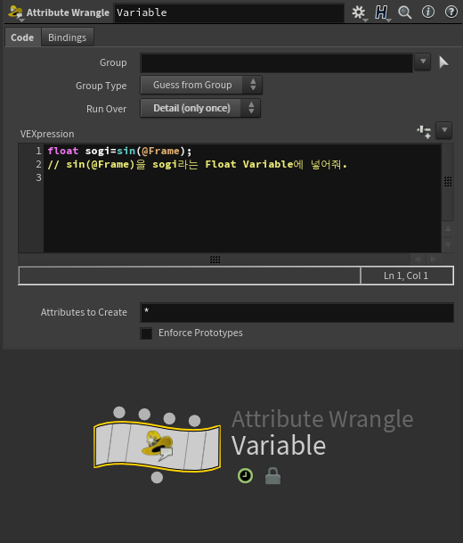
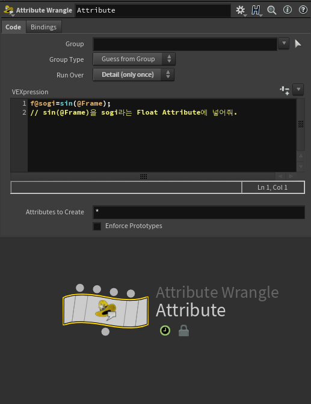

Houdini에서 Variable & Attribute에 대해 알아봅시다.


  

## Attribute와 Variable

Attribute와 Variable은 Input에서 가지고 있는, 현재의 Node에서 만들어준 정보를 활용할 수있다는 공통점이 있지만, 결론 부터 말하자면, Attribute와 달리 Variable은 현재의 Node, **현재의 Wrangle에서만 활용할 수있는 데이터**입니다. 그렇다면 Attribute는 정보를 다른 노드에서도 활용할 수있기때문에 조금 더 무게가 나가겠지만, 정보를 넘겨줄 수있겠습니다.  
  

### Attribute(정보) vs Variable(변수)

Attribute는 추후 데이터를 가지고 자유로이 작업 가능하다는 점입니다.  
그렇다면 Attribute가 무엇일까요?

Attribute는 정보로써, Point, Vertex, Primitives, Detail에 저장되어,  
Attribute는 데이터의 조각으로, 다양한 Level에서 정보를 저장하고 활용할 수 있습니다. 이는 Point, Vertex, Primitives, 그리고 Detail에 대한 속성을 정의합니다.

#### 01 Attribute와 Variable의 차이  


float sogi=sin(@Frame);
// sin(@Frame)을 sogi라는 Float Variable에 넣어줘.

f@sogi=sin(@Frame);
// sin(@Frame)을 sogi라는 Float Attribute에 넣어줘.



  


.obsidian이랑 jenkins대응


<table width="100%" style="table-layout: fixed; border-collapse: collapse; border: none;"> <tr style="border: none;"> <td width="50%" style="text-align: center; border: none; padding: 5px;">  <br><strong>[구조 A: 로컬 변수 / 초기 데이터]</strong> </td> <td width="50%" style="text-align: center; border: none; padding: 5px;">  <br><strong>[구조 B: 글로벌 어트리뷰트 / 바인딩 데이터]</strong> </td> </tr> </table>

(표 테스트중)


  

Run Over : Detail로 잡음.

이 작은 차이는 **지속성**과 **데이터 용량**에 있습니다.  
먼저 **지속성**입니다.

**ㄱ 지속성**

  


  

Detail 정보

Variable은 지속적이지 않고 Node안에서 한번 구현가능하고, Attribute는 영구적이게 Attribute안에 Memory에 저장됩니다.  
그렇기때문에 아래에 **데이터 용량**, Memory와 맞닿아 있습니다.

**ㄴ 데이터 용량, Memory**

  


#### 02 Variable의 활용

Variable은 Node내에서 처리만을 원할때 활용 합니다.


Point와 Line을 추가하는 Vex

```
int pt1=addpoint(0,set(0,0,0));
//addpoint라는 함수를 활용하여 0,0,0에 점을 추가해서 pt1의 int variable에 저장해줘

int pt2=addpoint(0,set(0,1,0));
//addpoint라는 함수를 활용하여 0,0,0에 점을 추가해서 pt2의 int variable에 저장해줘

addprim(0,'polyline',pt1,pt2);
//addprim이라는 함수를 활용하여 pt1, pt2를 이어주는 Polyline 추가해줘
```

#### 03 Attribute의 활용  


Box를 가져오겠습니다.

  
P 데이터, Position에 활용해보죠.


```
@P.y=@P.y+2;
//Input1에서의 Position Y데이터에서 2를 더해줘
```

Color 데이터, Cd에 활용해보죠.


```
@Cd=set(0,0.6.0);
//Input1에서의 Color 데이터에 Red:0, Green:0.6, Blue:0을 넣어줘
```

Attribute를 저장하는 지는 알겠는데, Point정보에 넣어달라는 말이 무엇일까요?  
여기에서 알 수 있듯, Point, prim, Detail 등에 따라서 저장되는 **Attribute Level**이 달라집니다.

```
@P.x=@P.x+2;
//Point Attribute에 저장 

@Cd=set(0,0.6.0);
//Point Attribute에 저장
```
