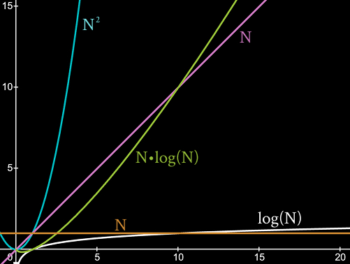
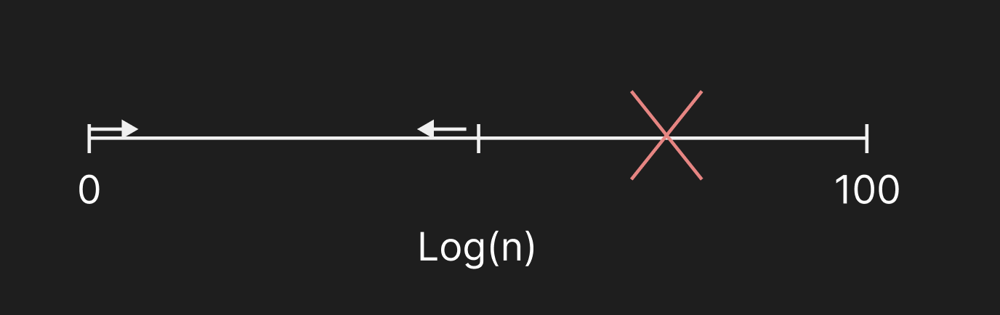

---

layout: post
title: Big-O 표기법이란?
date: 2026-06-03 16:10:00 +0900
description: 상용 엔진(Unreal)의 API 뒤에 숨겨진 렌더 파이프라인을 제어하기 위한 로우레벨 DirectX 엔진 프레임워크 설계 기록입니다.
thumbnail-img: /assets/postimg/ThorArchitecture/FrameWork_001.jpg
categories:
- C++
tags:
- cpp
- Framework
- Architecture

- Graphics-Pipeline

---

### 서론
Houdini 아트만 작업을 했을때는 생각하지 않았던것은 단언컨데 '실시간성'이다. Compute를 얼마나 해서 연산과정이 오래걸리냐는 뒷전이었다.
프로그래밍을 접하게 되면서 크게 와닿았던 것중에 하나는, ***알고리즘의 효율성*** 이라는 것이다. For-loop를 돌리더라도 이중 for문을 가볍게 생각을 했었는데, 조심해야할 필요가 있다는 것을 알게되며 어떠한 측정법으로 그 효율성을 측정할 수 있을까에 대한 대답중 하나가 시간 복잡도를 분석하는 것이다.

### Big-O 표기법이란?
- 알고리즘의 효율성을 측정하는 지표로, **'입력 크기가 증가할 때 연산량이 어떻게 변화하는가'**를 나타냅니다.
- Order of라 부르며, O(N)라 표기한다

**계산 규칙 : **
* 01 가장 큰, 대표적인 인자만을 남기고 모두 삭제
* 02 상수인자 제거

#### 예시 코드 분석
```

#include <iostream>  
using namespace std;  
  
int add(int num)  
{  
    int sum = 0; 
    // O(1)
    
    for(int x=0 ; x < num; x++)
	    sum += 4;
	// O(N)
	
    for(int i = 0 ; i < num ; i++)  
    {  
        for (int j =0 ; j < 2*num ; j ++)  
        {  
            sum += 1;  
        }  
    } 
    // O(2N²)
    return sum;  
}  
  
int main()  
{  
    cout<<"Sum Result : "<<add(2) <<endl;  
        return 0;  
}

```

```
Sum Result : 8
```
위 add함수의 시간 복잡도는

O( 1 + N + 2N² )
= 0(N²)이다.

  


log(N)도 많이 훌륭한 것이다.
훌륭한 Sort 알고리즘의 Big-O는 Nlog(N)을 넘어가지 않는다.

  
Log(N)은 범위가 다음 번에는 반으로 줄고 줄고 들어가는것


### List vs Vector Big O


| Big O | List | Vector |
|-------|------|--------|
| 시작 삽입/삭제 | O(1) | O(1) |
| 중간 삽입/삭제 | O(1)* | O(1) |
| 끝 삽입/삭제 | O(1) | O(1) |
| 임의 접근 | O(N) | O(1) |

* List 중간 삽입/삭제는 삽입 위치까지의 탐색 시간(O(N))을 제외한 수치
* 중간 노드를 Cache로 기억하지 못할때의 List 중간 삽입삭제 : O(N)

### 결론
시간 복잡(Big-O)는 수학적인 대수접근일 뿐이며, 이 역시 실제 퍼포먼스는, ***캐시 Hit률***, ***데이터 크기***에 따라.결정된다.

n²이 n보다 느린 경우도 있다
(예시 : map과 hash_map)
시스템 설계시 모조건 고효율 알고리즘보다는 데이터 규모, 환경에 맞는 유연한 선택이 중요!


### 추가 고민
* 01 Context Animation 데이터 중 특정 데이터를 찾을때, HashMap vs 선형 탐색..?
* 02 자주 사용되는 Animation Data를 Vector, List중 어디 두냐는 데이터 지역성을 결정하며 -> 실시간 퍼포먼스와 직결 될 것으로 추정